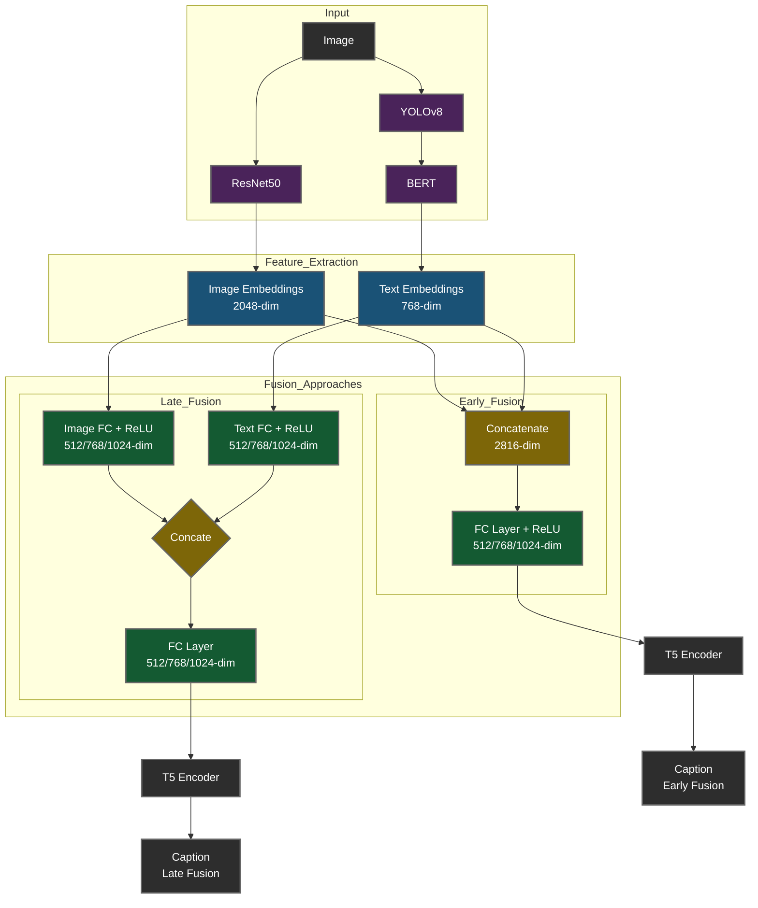

# CaptionCraft-MultiModal

## Introduction
CaptionCraft-MultiModal is a project focused on creating captions for multimedia content using multimodal approaches. This project leverages advanced techniques to provide accurate and context-aware captions for various types of media.

## Training Overview
The training process involves several key steps:



The training module includes detailed instructions and scripts to prepare and train models on your own datasets. For more information, refer to the training [README](https://github.com/astro215/CaptionCraft-MultiModal/blob/main/training/README.md).

## Tech Stack

- Jupyter Notebook: For data analysis and experimentation.
- Python: The programming language used for model development.
- PyTorch: The deep learning framework used to build and train the models.
- Streamlit: For deploying the model as an interactive web application.
- YOLO: For object detection in images.
- ResNet: For generating image embeddings.
- BERT: For generating text embeddings


## Setup and Installation
To set up the project, follow these steps:
1. Clone the repository:
   ```
   git clone https://github.com/astro215/CaptionCraft-MultiModal.git
   ```
2. Navigate to the project directory:
   ```
   cd CaptionCraft-MultiModal
   ```
3. Install the required dependencies (if any):
   ```
   pip install -r requirements.txt
   ```


